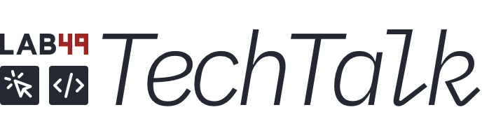

<h3>&nbsp;</h3>

  

<h1 align=center>Lab49 TechTalk: Making Meaningful API Contracts</h1>

#### Info
### Date: 2021-09-10
### Location: Online
### Presenter: Balazs Edes

<h3>&nbsp;</h3>

#### Links
### YouTube: https://youtu.be/YDh2Wn0Eeek
### Twitter:
### LinkedIn:

Backend devs would like their APIs to be understood, and used to its fullest, while frontend devs would like to have a stable API and data model that they understand and can rely on. 
 
In this presentation, Lab49 engineer Balazs Edes will show you a tool he's been building to achieve this using Typescript + OpenAPI (Swagger) + code generation. There's a short presentation, then live coding with many examples.

## License

MIT @ [Lab49](https://lab49.com)

###### [⇡ Top](#)

## Sponsored by Lab49

###### [⇡ Top](#)
